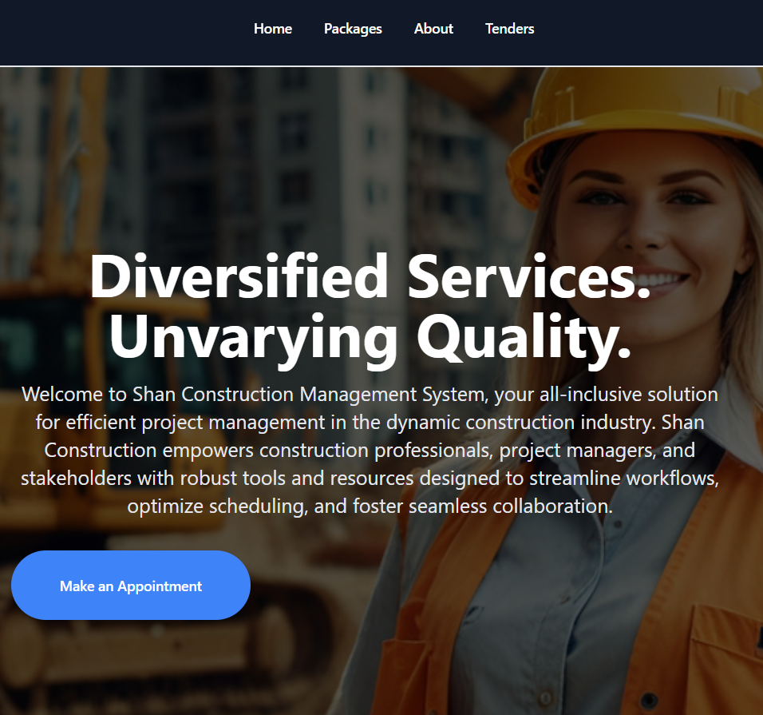

# 🏗️ Shan Construction - Client Management System

This project was developed as part of the **ITP Project (2nd Year, 2nd Semester)**.  
Our group built a **Construction Management Web Application** using the **MERN Stack**.

  

My contribution was the **Client Management Module**, which allows clients and managers to manage appointments and client records efficiently.

---

## ✨ Features (Client Management Module)

### For Clients
- Book an appointment online.
- View appointment status (Pending / Approved / Removed).
- If approved, download the confirmation document as PDF.
- Secure login system for registered clients.

### For Client Manager
- Manage appointment status (Confirm / Remove).
- View and filter appointments (by date, approved, pending, deleted).
- Add new clients with full validation.
- Search for client details quickly.
- Manager login with role-based access.

---

## 🛠️ Tech Stack
- **Frontend:** React.js, CSS
- **Backend:** Node.js, Express.js
- **Database:** MongoDB
- **Other Tools:** Mongoose, JWT Authentication, PDF Generation Library

---
